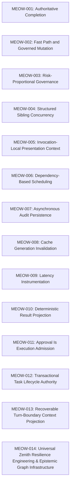

# MEOW/ACC Architecture Decision Index

These Architecture Decision Records (ADRs) document the principles, constraints, and engineering designs governing the MEOW/ACC critical-path execution runtime.

---

## 1. Scheduling
Decisions governing the admission, concurrency limits, and execution order of sibling tools.
* **[MEOW-004: Structured Sibling Concurrency](MEOW-004-structured-sibling-concurrency.md)**
  Establishes task-owned concurrency, thread boundaries, and independent error recovery.
  * *Implementing Surface:* [SiblingToolScheduler.ts](file:///Users/bozoegg/Downloads/codemarie-new/src/core/task/tools/siblings/SiblingToolScheduler.ts)
* **[MEOW-006: Dependency-Based Scheduling](MEOW-006-dependency-scheduling.md)**
  Defines the scheduler's dependency model, prerequisite mapping, and resource claims.
  * *Implementing Surfaces:* [SiblingToolDependency.ts](file:///Users/bozoegg/Downloads/codemarie-new/src/core/task/tools/siblings/SiblingToolDependency.ts) and [index.ts](file:///Users/bozoegg/Downloads/codemarie-new/src/core/task/index.ts)

## 2. Authority Reuse
Decisions governing risk-proportional governance and caching of workspace authorities.
* **[MEOW-012: Transactional Task Lifecycle Authority](MEOW-012-transactional-task-lifecycle.md)**
  Makes `TaskLifecycleFunnel` the sole generation-bound task-state transition and lifecycle event authority.
  * *Implementing Surface:* `src/core/task/lifecycle/TaskLifecycleFunnel.ts`
* **[MEOW-011: Approval Is Execution Admission](MEOW-011-execution-approval-admission.md)**
  Makes `ExecutionFunnel` the sole approval decision and permit authority; handlers declare pure intents only.
  * *Implementing Surface:* `src/core/task/tools/execution/ExecutionFunnel.ts`
* **[MEOW-002: Fast Path and Governed Mutation](MEOW-002-fast-path-governed-mutation.md)**
  Separates read-only/reversible execution paths from blocked mutation fences.
  * *Implementing Surfaces:* [ToolExecutor.ts](file:///Users/bozoegg/Downloads/codemarie-new/src/core/task/ToolExecutor.ts) and [ToolValidator.ts](file:///Users/bozoegg/Downloads/codemarie-new/src/core/task/tools/ToolValidator.ts)
* **[MEOW-003: Risk-Proportional Governance](MEOW-003-risk-proportional-governance.md)**
  Balances validation overhead against material risk, allowing advisory operations to run asynchronously.
  * *Implementing Surface:* `src/core/task/tools/execution/ExecutionFunnel.ts`

## 3. I/O Generations
Decisions governing the caching, coalescing, and validation of file/search results.
* **[MEOW-008: Cache Generation Invalidation](MEOW-008-cache-generation-invalidation.md)**
  Implements generation-aware caching to prevent stale results from crossing mutation boundaries.
  * *Implementing Surfaces:* [IoRequestCoalescer.ts](file:///Users/bozoegg/Downloads/codemarie-new/src/core/task/tools/io/IoRequestCoalescer.ts) and [TaskPathAuthorityCache.ts](file:///Users/bozoegg/Downloads/codemarie-new/src/core/task/tools/io/TaskPathAuthorityCache.ts)

## 4. Deterministic Projection
Decisions governing presentation isolation and output ordering.
* **[MEOW-013: Recoverable Turn-Boundary Context Projection](MEOW-013-recoverable-context-projection.md)**
  Keeps durable transcripts authoritative while applying bounded, hash-addressed compaction only to completed-turn request projections.
  * *Implementing Surfaces:* `src/core/context/context-management/ContextManager.ts`, `src/core/context/ContextPruner.ts`, and `src/core/task/index.ts`
* **[MEOW-005: Invocation-Local Presentation Context](MEOW-005-invocation-local-presentation.md)**
  Isolates in-flight presentation state and output buffers for concurrent siblings.
  * *Implementing Surface:* [ToolInvocationContext.ts](file:///Users/bozoegg/Downloads/codemarie-new/src/core/task/tools/siblings/ToolInvocationContext.ts)
* **[MEOW-010: Deterministic Result Projection](MEOW-010-deterministic-result-projection.md)**
  Ensures that sibling results are replayed and projected in model-emission sequence order.
  * *Implementing Surface:* [index.ts](file:///Users/bozoegg/Downloads/codemarie-new/src/core/task/index.ts)

## 5. Authoritative Completion
Decisions governing the completion lifecycle and deferred observability.
* **[MEOW-001: Authoritative Completion](MEOW-001-authoritative-completion.md)**
  Centralizes the completion decision, decoupling it from non-blocking downstream dependencies.
  * *Implementing Surface:* [AttemptCompletionHandler.ts](file:///Users/bozoegg/Downloads/codemarie-new/src/core/task/tools/handlers/AttemptCompletionHandler.ts)
* **[MEOW-007: Asynchronous Audit Persistence](MEOW-007-async-audit-persistence.md)**
  Defers non-authoritative logging and audit serialization until after result presentation.
  * *Implementing Surface:* [completionAudit.ts](file:///Users/bozoegg/Downloads/codemarie-new/src/shared/audit/completionAudit.ts)
* **[MEOW-009: Latency Instrumentation](MEOW-009-latency-instrumentation.md)**
  Defers telemetry aggregation and latency instrumentation outside critical mutation execution boundaries.
  * *Implementing Surface:* `src/core/task/latency/TaskLatencyTracker.ts`

## 6. Resilience & Epistemic Substrate
Decisions governing tool circuit breaking, transient read caching, lock jitter, epistemic confidence propagation, 4-pillar forensic probing, and task DAG scheduling.
* **[MEOW-014: Universal Zenith Resilience Engineering & Epistemic Graph Infrastructure](MEOW-014-universal-zenith-resilience.md)**
  Establishes sliding-window circuit breakers, 500ms speculative read caching, adaptive lock backoff jitter, Epistemic PageRank confidence scoring, 4-pillar forensic diagnostic probes, and Task DAG dependency scheduling.
  * *Implementing Surfaces:* `broccolidb/core/agent-context/StreamingToolExecutor.ts`, `broccolidb/infrastructure/db/BufferedDbPool.ts`, `broccolidb/core/agent-context/ReasoningService.ts`, `broccolidb/core/agent-context/TaskService.ts`

## Architectural Decision Dependency Graph

