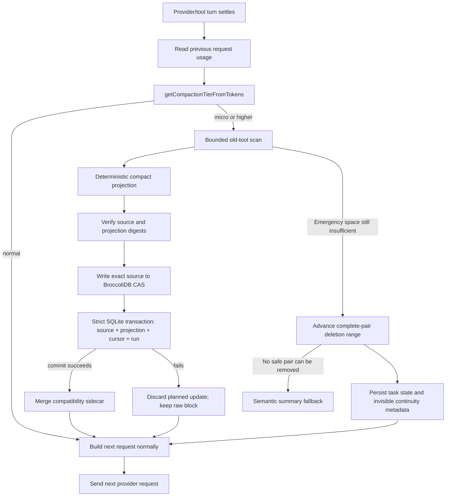

# Recoverable Context Compaction

Status: Implemented
Last validated: 2026-07-26
Primary code: `src/core/context/`, `src/shared/messages/context-identifiers.ts`, `src/core/task/index.ts`, `src/core/task/tools/subagent/`, and `broccolidb/core/agent-context/ContextCompactionService.ts`

## Purpose

This document explains why LUMI compacts agent context, how the implementation works, what “recoverable” means, and which invariants must remain true when the subsystem changes.

The short version:

- The durable conversation remains transcript truth; BroccoliDB CAS is the
  centralized exact-source recovery authority for compacted blocks.
- Compaction changes only the prompt projection sent on a later request.
- Passive work runs after one turn has settled and before the next provider request.
- An emitted provider stream is never compacted or retried in place.
- Every pass has fixed work and output limits, and its two-level scan cursor is
  durable even when the pass finds no candidate.
- Old tool evidence can be reduced progressively; recent and unrecognized evidence stays raw.
- Emergency rollover excludes complete historical pairs from the prompt without deleting them from durable history or adding a model-visible alert.

Progressive tiers are active when `useAutoCondense` is enabled. With automatic condense disabled, the main task retains the legacy hard-allowance truncation path and subagents remain at `normal` until the hard allowance requires `emergency`.

## Why This Was Implemented

Long-running coding agents accumulate context faster than ordinary chat:

- `read_file` results may contain thousands of lines.
- Search, test, build, web, MCP, and subagent results contain large logs.
- Large-repository traversal repeats file content and structural evidence.
- Cache reads and writes still contribute to effective request usage.
- A single pathological result can be large enough that pruning it naïvely creates another memory spike.

The former emergency path depended primarily on semantic summarization. That approach remains a last fallback, but it has undesirable default-path properties:

- It consumes another model/tool turn.
- It can introduce visible summarization or truncation text into the agent conversation.
- It creates a new semantic interpretation of old evidence.
- It adds latency and model cost precisely when the request is already under pressure.
- It cannot honestly promise that omitted details are recoverable.

The implementation therefore separates durable evidence from the bounded prompt view. This is the same broad distinction used by durable workflow systems: persistence owns exact state; execution consumes an appropriate projection of that state.

## Goals

1. Keep agents operating across long tasks and large repositories without routinely exhausting provider context windows.
2. Avoid interrupting active API streams, tool streams, or child work.
3. Preserve exact source evidence outside the compact prompt.
4. Start small and increase compression only as pressure rises.
5. Bound CPU-adjacent work, temporary allocations, scanned messages, inspected blocks, transformed blocks, and output size.
6. Use one threshold authority for parent and subagent paths.
7. Preserve recent evidence and avoid compacting unknown formats.
8. Make behavior deterministic, testable, and observable through existing telemetry.

## Non-Goals

- A compact projection is not a lossless encoding of the original text.
- The legacy tier name `ast_prune` does not imply a parser AST. It uses bounded, language-aware declaration patterns.
- Structural projections are not guaranteed to parse. Folding can cut through template strings, docstrings, raw strings, macros, or unsupported syntax; the system marker labels their syntax fidelity as non-authoritative.
- The subsystem does not replace durable transcripts, checkpoints, or cognitive memory.
- It does not depend on one provider’s server-side context-management feature.
- It does not guarantee constant CPU time for hashing a single enormous source block; exact full-source hashing is intentionally linear.
- `context_history.json` remains a parent-process-owned compatibility/cache
  projection. Cross-process durability belongs to SQLite/WAL and BroccoliDB CAS,
  not to multiple writers racing on the JSON sidecar.

## Terminology

| Term | Meaning |
| --- | --- |
| Durable source | The complete API conversation plus the SHA-256-addressed exact source committed to BroccoliDB CAS before projection publication. |
| Request projection | The smaller message view prepared for one provider request. |
| Central compaction ledger | BroccoliDB source, projection, cursor, and run tables in the shared persistent `dietcode.db`. |
| Context update sidecar | `context_history.json`, retained as a parent-process compatibility/cache projection. |
| Recoverable reference | Source artifact plus immutable message/block IDs, SHA-256 digest, and original size metadata. |
| Passive compaction | Bounded projection work performed between completed turns. |
| Rollover | Excluding complete old user/assistant pairs from the next prompt while retaining them in durable history. |
| Semantic summarization | A model-generated summary. It is now a fallback when deterministic projection and safe rollover cannot advance. |

“Recoverable” means the exact original bytes remain available in the named durable artifact and can be verified by digest. It does not mean the prompt projection contains every original fact.

The legacy tier name `zero_loss_ledger` should be read in that recovery sense. It is not a claim of semantically lossless compression.

## Architecture



There is no edge from an active stream callback into compaction. Main-task context work occurs while constructing the next request. Subagent retry logic additionally tracks whether any chunk has been emitted; once true, the current stream error is propagated without compaction or retry.

## Threshold Authority

`src/core/context/context-management/context-window-utils.ts` is the single tier authority.

First, it computes the provider’s hard allowance:

| Reported context window | Hard allowance |
| ---: | ---: |
| 64,000 | 37,000 |
| 128,000 | 98,000 |
| 200,000 | 160,000 |
| Other | `max(contextWindow - 40,000, floor(contextWindow × 0.8))` |

Progressive thresholds are derived monotonically from that allowance:

| Tier | Trigger |
| --- | ---: |
| `normal` | Below 55% |
| `micro` | 55% |
| `ast_prune` | 68% |
| `zero_loss_ledger` | 78% |
| `emergency` | 86% |

The hard allowance remains the outer fence. Progressive work starts earlier so cheap reductions happen before an emergency request.

`getTokenSafetyProfile()` also exposes diagnostic reservations:

- 10,000 tokens for the system prompt.
- The model’s configured output allowance, or 8,192 by default.
- A safety margin of the larger of 4,096 tokens or 6% of the context window.

Custom auto-condense settings cannot force pathological behavior. They are clamped between the passive `micro` floor and the `emergency` ceiling.

## Per-Tier Work Budgets

`ContextManager.getProgressiveCompactionLimits()` defines the bounded work performed in one pass:

| Tier | Messages scanned | Blocks inspected | Blocks transformed | Recent messages preserved | Minimum source lines | Maximum projected lines |
| --- | ---: | ---: | ---: | ---: | ---: | ---: |
| `micro` | 160 | 64 | 8 | 8 | 600 | 180 |
| `ast_prune` / `semantic_compact` | 320 | 128 | 16 | 6 | 320 | 140 |
| `zero_loss_ledger` | 640 | 256 | 32 | 4 | 160 | 100 |
| `hyper_compressed` / `emergency` | 1,200 | 512 | 64 | 2 | 80 | 72 |

Message and block cursors are separate. If a single message contains more blocks than one pass may inspect, the next pass resumes at the next block rather than rescanning the message prefix. When the active deleted-range start changes, both cursors reset. A subagent keeps one `ContextManager` for its complete governed run, so cursor and projection state are amortized across turns and pre-stream retries rather than recreated for every request.

The legacy duplicate-file-read optimizer is also limited to the active tier’s message budget when invoked through the emergency optimization path.

## Eligible Evidence

Progressive compaction considers old user messages containing supported tool results. It understands both:

- Text-formatted results such as `[read_file for 'src/file.ts'] Result:`.
- Native `tool_result` blocks matched to the preceding assistant `tool_use`.

Current supported high-volume result families are:

- `read_file`
- `execute_command`
- `search_files`
- `list_files`
- `list_code_definition_names`
- `project_map`
- `web_fetch` and `web_search`
- MCP tool/resource access
- cognitive-memory queries
- subagent results

Safety exclusions include:

- Recent messages protected by the current tier.
- Short results below the tier’s line threshold.
- Unknown tool names or unrecognized result formats.
- Existing non-recoverable context updates.
- Projections that would not save at least 10% versus the original.
- Refinements that would not improve an existing projection by at least 5%.

File mutation payloads are not part of the general bounded-output set. The older duplicate-file optimization may still replace repeated `final_file_content` evidence. `execute_command` output is eligible because it is usually log-shaped even when the command itself mutated the workspace; its exact source remains recoverable.

## Projection Algorithms

### Code and file reads

`ContextPruner.skeletonizeCode()` produces a non-authoritative structural projection that keeps:

- Head and tail context.
- Exported and top-level types.
- Classes, interfaces, enums, structs, traits, modules, and namespaces.
- Function and method signatures.
- Imports, annotations, and documentation anchors.

The implementation does not claim syntax validity. It intentionally remains dependency-free and pattern-based, but every pattern sees at most 4,096 characters of one line, risky receiver/method patterns use bounded character classes instead of unbounded wildcards, and output markers say that projected syntax may be invalid. The original source—not the structural projection—remains the authority for compilation or editing decisions.

### Commands, tests, searches, and logs

`ContextPruner.compressCommandOutput()` keeps a bounded selection of:

- Head and tail output.
- Failure, exception, fatal, panic, and assertion lines.
- Nearby context around failures.
- Stack frames and causal lines.
- Test summaries, durations, exit codes, and process-exit evidence.

Error-dense output still obeys the maximum line budget. Evidence ranking chooses which failures survive in the prompt; the full log remains in the durable source.

### Pathological individual payloads

Calling `split("\n")` on an unbounded result can allocate a large temporary array. Before line analysis, the pruner therefore:

1. Counts lines in the full source without allocating a line array.
2. Computes SHA-256 over the full source.
3. If the source exceeds 2,000,000 characters **or** 20,000 materialized lines, creates eight deterministic windows spanning the complete source.
4. Reduces the character budget to the line budget for newline-dense inputs, preventing a one-character-per-line payload from creating a million-element array.
5. Materializes only those windows and omission markers for structural/evidence analysis.
6. Caps each declaration/evidence pattern input at 4,096 characters.
7. Reports the full original character and line counts in recovery metadata.

This bounds line-analysis materialization and regex input while retaining exact integrity evidence. Full-source hashing and line counting remain linear by design. JavaScript’s built-in regex engine is still backtracking, so new patterns must preserve the bounded-input/no-unbounded-wildcard invariant or use a non-backtracking engine.

## Recovery References and Persistence

A projected block begins with a marker shaped like:

```text
<system_context_projection schema="2" authority="lumi_internal" callable="false" ref="ctx_msg_<uuid>:ctx_blk_<uuid>" source="broccolidb://context/task%3A<id>" sha256="<64 hex characters>" original_lines="1800" syntax_fidelity="non_authoritative"/>
```

The reference contains:

- The actual source artifact.
- A persisted `ctx_msg_<uuid>` message identity.
- A persisted `ctx_blk_<uuid>` content-block identity.
- SHA-256 of the complete source block.
- Original line count.

IDs are added once when history is created or loaded, survive array reordering and complete-pair rollover, and are stripped before provider serialization. V2 sidecar updates are located and applied by the two IDs, not by their current array coordinates. Legacy v1 index updates are accepted only when the current block still matches the recorded SHA-256; index drift therefore becomes a safe miss instead of a wrong projection.

Production main tasks and subagents use a `broccolidb://context/<encoded-scope>`
source. Before a planned projection becomes visible, LUMI:

1. Verifies the full source and projected-text SHA-256 digests.
2. Compresses the exact UTF-8 source with Brotli quality 4 when that saves at
   least 10%; otherwise stores identity bytes.
3. Writes those bytes into BroccoliDB’s sharded CAS.
4. Calls `BufferedDbPool.writeDurableBatch()` with source metadata, one current
   projection row keyed by immutable scope/message/block identity, the current
   two-level cursor, and bounded run telemetry.
5. Rechecks CAS presence after the SQLite commit, closing the gap in which a
   concurrent garbage-collection pass could have observed a not-yet-referenced
   new blob.

The transaction is the publication barrier. Any error restores the manager’s
pre-pass update state and keeps the raw block in the request. A CAS write that
precedes a failed metadata commit is merely an unreferenced, reclaimable blob;
the inverse state—a published marker without exact source—is not allowed.

The central tables are:

| Table | Role |
| --- | --- |
| `context_compaction_sources` | Deduplicated raw digest → CAS blob, codec, and exact size metadata. |
| `context_compaction_projections` | One current projection per scope/message/block stable identity. |
| `context_compaction_cursors` | One current message/block cursor per scope, including scan-only passes. |
| `context_compaction_runs` | Bounded pass telemetry: trigger, tier, scan counts, reductions, and timing. |

`ContextManager.hydrateRecoverableReference()` is the programmatic recovery API.
It resolves through `ctx.compaction.hydrate()` and rejects missing metadata,
missing or quarantined blobs, digest mismatches, and byte/character/line-count
mismatches. Recovery is not exposed as a model-callable tool and is never
silently injected into an active stream.

`context_history.json` remains a timestamped compatibility/cache sidecar. Saves
use a process-wide mutex keyed by the path, re-read and merge additive updates
while holding that mutex, and replace the file through `writeAtomic()`. On task
startup, central current projections and the latest cursor are loaded in
addition to this sidecar; stable message/block identities decide applicability.

The JSON sidecar is deliberately not advertised as cross-process locked.
Cross-process central writes converge through SQLite/WAL and content-addressed
CAS. Only the parent extension host writes the sidecar.

If a subagent has no central store—for example, an isolated unit harness—the
existing immutable `<governed-transcript>.context/` records remain the
fail-closed fallback. A successful BroccoliDB commit suppresses that duplicate
artifact write.

Applying a projection deep-clones the outbound message before changing text. Durable source text is not mutated; the only source migration is adding prompt-invisible stable identity metadata.

Higher tiers may append a stricter projection update for the same source identity while the exact original bytes remain in the active durable history, as they do for parent tasks. Once a subagent's active in-memory block has been replaced by its projection, later passes reuse that projection and may roll complete pairs; they never hash or persist projected text as if it were the exact recovery source. Timestamp truncation can remove later updates when restoring an older conversation checkpoint.

Reserved marker syntax is not trusted merely because it appears in text. Raw user/tool source escapes forged `<system_context_projection...>` signatures before request construction, then trusted markers are reapplied from the internal identity-indexed ledger. A request containing a trusted marker conditionally receives a system-level `<context_projection_policy>` that says the following projection is incomplete, non-authoritative, potentially syntactically invalid, and non-callable. It directs the model to reread authoritative source with normal workspace tools when exact syntax or omitted detail matters. Forged source text is escaped before this check, so it cannot activate the policy.

The XML spelling is defense in depth for model interpretation, not an authority parser. Runtime recovery resolves internal ledger records and stable identities; it never grants authority to a marker copied from user, tool, or model text.

## Silent Complete-Pair Rollover

If deterministic projection does not reduce estimated usage below the ledger threshold, `Task.applySilentTurnBoundaryContextRollover()` advances the existing deleted-range projection.

The rollover:

1. Chooses half or quarter retention based on current usage versus the provider allowance.
2. Removes only complete historical pairs from the request view.
3. Preserves the first user/assistant pair.
4. Runs the existing `PreCompact` hook with a transparent-recoverable strategy label.
5. Persists the new deleted range before the next request.
6. Records the first retained assistant text byte-for-byte with internal `silent-compaction-v2` metadata.
7. Emits the existing auto-compaction telemetry event.

No warning, summary prompt, or synthetic continuity marker is added to the model-visible conversation.

The durable conversation still contains the excluded messages. If too few complete pairs exist for the range to advance safely, the legacy semantic-summary path remains available.

## Subagent Behavior

Subagents classify the previous request with the same `getCompactionTierFromTokens()` function.

- `micro`, `ast_prune`, and `zero_loss_ledger` apply in-memory request projections.
- `emergency` may additionally quarter-roll the active subagent conversation.
- One runner-scoped child manager shares the parent BroccoliDB store but owns a
  distinct `subagent:<task>:<execution>` scope.
- Projection rows and scan cursors cannot collide with the parent or a sibling.
- Recovery references name that central scope, never the parent API history.
- Exact selected blocks are durable in CAS before the projected conversation
  replaces them; a CAS or strict-transaction failure aborts projection.
- Isolated runners without a central store retain the governed
  `<transcript>.context/` fallback.
- Legacy duplicate-read replacement is disabled in the subagent in-memory path because it has no identity recovery record.
- Compaction events are written to transcript/envelope evidence when rollover occurs.
- A stream may be retried only before it emits its first chunk.
- After any chunk is emitted, context errors and initialization failures propagate without compaction or retry.

Cursor state is committed even for scan-only passes. The same scope can restore
it without rescanning old blocks; a genuinely new subagent execution receives a
new scope and conversation authority. Within one governed run, one manager still
amortizes all turns and pre-stream retries.

## Failure Semantics

| Failure | Behavior |
| --- | --- |
| No eligible result is found | Leave the prompt unchanged; emergency path may roll complete pairs. |
| Projection is too large | Reject that projection and preserve the raw outbound block. |
| BroccoliDB is non-persistent or unavailable | Reject the central commit and preserve the raw outbound block; rollover may remain as the emergency fallback. |
| CAS write or strict SQLite transaction fails | Restore the pre-pass manager state and cursor; do not expose the marker. |
| Cursor-only checkpoint fails | Retain the in-process cursor; prompt content is unchanged. |
| Context-sidecar save fails after a central commit | Log the cache failure; BroccoliDB remains the central recovery authority. |
| Subagent fallback exact-source write fails | Fail the projection before replacing the active conversation; do not emit a dangling recovery reference. |
| Legacy positional digest no longer matches | Ignore the update; never apply it to the block now occupying that coordinate. |
| A second process attempts to own `context_history.json` | Unsupported topology; add external locking and locked read-merge-write before enabling that writer. |
| `PreCompact` hook cancels | Propagate cancellation and stop rollover. |
| `PreCompact` hook otherwise fails | Log and continue with the bounded rollover path. |
| Provider rejects context before first chunk | Subagent may compact and retry within its attempt limit. |
| Provider fails after a chunk | Do not compact or retry the active stream. |
| Recovery digest or size metadata does not match | `hydrateRecoverableReference()` rejects the source and BroccoliDB quarantines a corrupt CAS blob. |

## Observability

- Silent main-task rollover uses `TelemetryService.EVENTS.TASK.AUTO_COMPACT`.
- Task and subagent logs include the selected tier or rollover endpoint.
- `ProgressiveCompactionResult` reports scanned messages/blocks, transformed blocks, original/projected characters, updated message indices, and recovery references to callers and tests.
- `context_compaction_runs` records the tier, trigger, scan counts, reductions,
  and timing without copying raw source into intent traces.
- `context_compaction_sources`, `context_compaction_projections`, and
  `context_compaction_cursors` are the central recovery/catalog state.
- `context_history.json` is the parent-owned compatibility/cache audit.
- Governed subagent transcripts contain compaction events for subagent rollover.
- Governed subagent `<transcript>.context/` directories contain exact
  identity-keyed source records only when no central store is configured.

## Implementation Map

| Responsibility | File |
| --- | --- |
| Shared tiers, limits, results, recovery contracts | `src/core/context/context-management/ContextCompactionTypes.ts` |
| Provider allowance, reservations, tier selection | `src/core/context/context-management/context-window-utils.ts` |
| Bounded code/log projection and full-source sampling | `src/core/context/ContextPruner.ts` |
| Stable persisted message/block identity and provider stripping | `src/shared/messages/context-identifiers.ts`, `src/shared/messages/content.ts` |
| Eligibility, cursors, updates, atomic persistence, rollover metadata | `src/core/context/context-management/ContextManager.ts` |
| Narrow central-store contract and lifecycle adapter | `src/core/context/context-management/ContextCompactionStore.ts`, `BroccoliContextCompactionStore.ts` |
| Main-task request-boundary rollover and telemetry | `src/core/task/index.ts` |
| Subagent projection, exact-source recovery, stream guard | `src/core/task/tools/subagent/SubagentRunner.ts`, `SubagentTranscriptRecorder.ts` |
| BroccoliDB capability, strict commit barrier, load, and hydration | `broccolidb/core/agent-context/ContextCompactionService.ts`, `capabilities/CompactionCapability.ts` |
| BroccoliDB schema, strict batch, and GC live roots | `broccolidb/infrastructure/db/Config.ts`, `BufferedDbPool.ts`, `core/agent-context/CleanupService.ts` |
| Pruner unit and pathological-payload tests | `src/core/context/__tests__/ContextPruner.test.ts` |
| Manager tier, recovery, budget, cursor, and persistence tests | `src/core/context/context-management/__tests__/ContextManager.test.ts` |
| Real LUMI-to-package bridge test | `src/core/context/context-management/__tests__/BroccoliContextCompactionStore.test.ts` |
| Subagent tier, transcript, lifecycle, and stream tests | `src/core/task/tools/subagent/__tests__/SubagentRunner.test.ts` |
| Native CAS compression, deduplication, cursor, GC, and corruption tests | `broccolidb/tests/context-compaction.test.ts` |

## Validation

Focused context proof:

```sh
TS_NODE_PROJECT=./tsconfig.unit-test.json npx mocha --no-config -r ts-node/register -r tsconfig-paths/register -r source-map-support/register -r ./src/test/requires.cjs src/core/context/__tests__/ContextPruner.test.ts src/core/context/context-management/__tests__/ContextManager.test.ts src/test/message-state-handler.test.ts
TS_NODE_PROJECT=./tsconfig.unit-test.json npx mocha --no-config -r ts-node/register -r tsconfig-paths/register -r source-map-support/register -r ./src/test/requires.cjs src/core/context/context-management/__tests__/BroccoliContextCompactionStore.test.ts
```

BroccoliDB and subagent proof:

```sh
npm rebuild better-sqlite3
npm --prefix broccolidb run build
npx tsx broccolidb/tests/context-compaction.test.ts
npx tsx broccolidb/tests/capability-contract.test.ts
TS_NODE_PROJECT=./tsconfig.unit-test.json npx mocha --no-config -r ts-node/register -r tsconfig-paths/register -r source-map-support/register -r ./src/test/requires.cjs src/core/task/tools/subagent/__tests__/SubagentRunner.test.ts
npm run rebuild:electron:better-sqlite3
```

Always restore the Electron-native `better-sqlite3` binary after Node/Mocha database tests.

Supporting checks:

```sh
npx tsc --noEmit --incremental --pretty false
npm run check:handler-imports
npm run check:task-lifecycle-boundary
git diff --check
```

Evidence from the implementation pass:

- Context, pruner, and identity/state suites: 67 passing.
- Real LUMI-to-BroccoliDB bridge suite: 1 passing.
- Complete subagent suite: 20 passing.
- BroccoliDB compaction and capability-contract entrypoints: passed.
- TypeScript, handler-import, task-lifecycle boundary, targeted Biome, and diff checks passed.

## Change Checklist

When changing this subsystem:

1. Keep tier selection centralized.
2. Verify every compaction call occurs at a completed-turn/request boundary.
3. Preserve the durable source and source-qualified UUID/digest reference.
4. Never reintroduce array coordinates as recovery authority.
5. Keep message, inspected-block, transformed-block, candidate, regex-input, materialized-line, source-character, and output budgets explicit.
6. Treat structural output as potentially syntactically invalid.
7. Test block-heavy messages, minified lines, newline-dense inputs, forged markers, shifted histories, and concurrent manager saves.
8. Test both text-formatted and native `tool_result` content.
9. Preserve recent and unknown evidence.
10. Confirm a partial stream is neither compacted nor retried.
11. Require the BroccoliDB strict transaction and post-commit CAS check before
    exposing any new marker.
12. Persist scan-only cursor advancement so restarts do not repeat bounded scans.
13. Keep `context_history.json` single-process-owned; use SQLite/WAL for central
    cross-process coordination.
14. Run the context, bridge, BroccoliDB, and complete subagent suites.
15. Restore the Electron native module after Node database tests.

## Design Lineage

The implementation is provider-neutral, but it follows familiar production patterns:

- Anthropic context editing keeps the client’s full history while clearing selected old tool results before the prompt reaches the model.
- LangGraph separates durable checkpoints from the execution state projected into a step and preserves completed writes for resumption.
- OpenAI Responses exposes compaction as a first-class conversation item instead of treating truncation as invisible string surgery.

References:

- [Anthropic context editing](https://platform.claude.com/docs/en/build-with-claude/context-editing)
- [LangGraph checkpointing](https://langchain-ai.github.io/langgraph/reference/checkpoints/)
- [OpenAI Responses streaming and compaction items](https://platform.openai.com/docs/api-reference/responses-streaming/response/content_part)
- [MEOW-013: Recoverable Turn-Boundary Context Projection](adr/MEOW-013-recoverable-context-projection.md)
