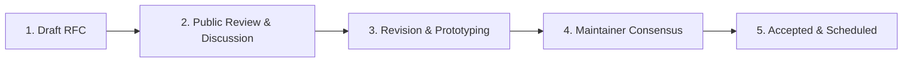

# LUMI Governance & RFC Charter

This document outlines the open-source governance structure, decision-making framework, maintainer roles, and RFC proposal process for the **LUMI** agentic AI engine project.

---

## 🏛️ Governance Principles

LUMI is guided by four core principles:

1. **Mechanical Sympathy & Performance**: Architectural decisions prioritize zero-GC allocation, sub-millisecond responsiveness, and low memory footprints.
2. **Minimal Core, Maximum Extensibility**: The engine core remains minimal. Advanced functionality is implemented via extensions, custom tools, or subagent swarms.
3. **Deterministic Verification & Safety**: Automated checks (`npm run check`, lockfile verification, micro-VM sandboxing) take precedence over subjective opinions.
4. **Transparent Community RFCs**: Major architectural transitions, provider protocol shifts, or breaking changes are proposed and evaluated through public RFCs.

---

## 👥 Roles & Responsibilities

### Contributors
Anyone who submits code, documentation, bug reports, or feature requests. Contributors follow the [`CONTRIBUTING.md`](CONTRIBUTING.md) quality guidelines and code of conduct.

### Approved Contributors (`lgtmi` / `lgtm`)
Contributors who have demonstrated high-signal contributions to the codebase.
- **`lgtmi`**: Approved to open issues without automatic auto-close triggers.
- **`lgtm`**: Approved to open both issues and pull requests.

### Maintainers
Maintainers have commit and release authority across the `@earendil-works/*` monorepo. They are responsible for:
- Triaging issues and pull requests daily.
- Reviewing RFC design proposals.
- Overseeing lockstep release publishing (`release:patch`, `release:minor`).
- Enforcing repository security, lockfile integrity, and code quality standards.

---

## 📝 Request for Comments (RFC) Process

For significant changes affecting core architecture, public APIs, substrate memory models, or host integration contracts, an RFC is required before implementation begins.

### When is an RFC Required?
- Major API contract changes in `@earendil-works/pi-agent-core` or `@earendil-works/pi-ai`.
- Modifications to `BroccoliDB` substrate memory layouts or zero-GC ring buffer protocols.
- Introducing new host client provider bridges or sandbox execution engines.
- Deprecating existing tools, flags, or provider integrations.

### RFC Workflow

1. **Drafting**: Write an RFC document specifying problem statement, architectural design, trade-offs, and migration path.
2. **Submission**: Submit proposals to the public RFC tracker at [rfc.earendil.com](https://rfc.earendil.com/keyword/pi/).
3. **Review & Consensus**: Community members and maintainers review the RFC. Approval requires consensus from at least two maintainers.
4. **Implementation**: Once accepted, implementation tasks are added to [`ROADMAP.md`](ROADMAP.md).

---

## 🚀 Release Cadence & Versioning

LUMI follows **lockstep versioning**:
- All 12 packages under `@earendil-works/*` share a unified version number.
- Releases are tagged as `vX.Y.Z`.
- **`patch` releases**: Bug fixes, dependency updates, and non-breaking additions.
- **`minor` releases**: Breaking API changes or major feature additions.

Releases are published automatically via GitHub Actions OIDC trusted publishing upon pushing a release tag.

---

## 💬 Code of Conduct

All participants in the LUMI project are expected to adhere to the [CODE_OF_CONDUCT.md](CODE_OF_CONDUCT.md). Violations should be reported to `governance@earendil.com`.
