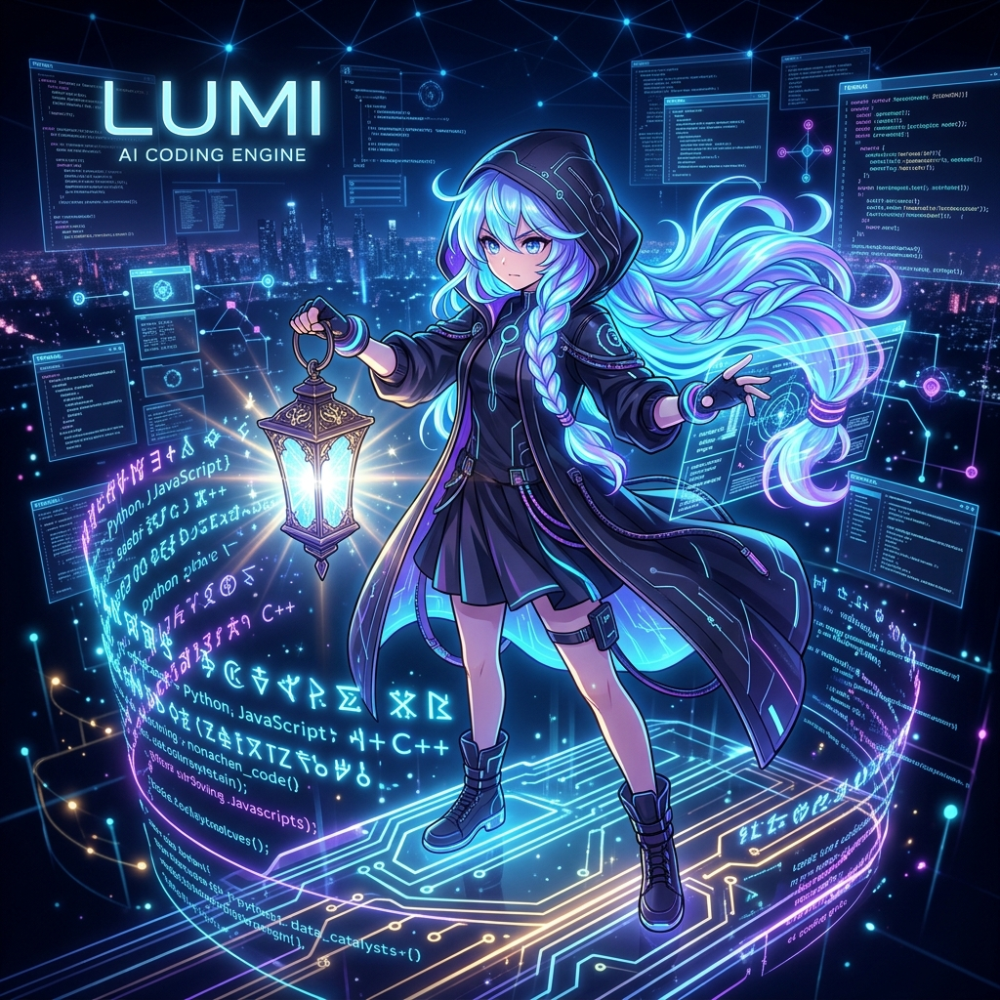
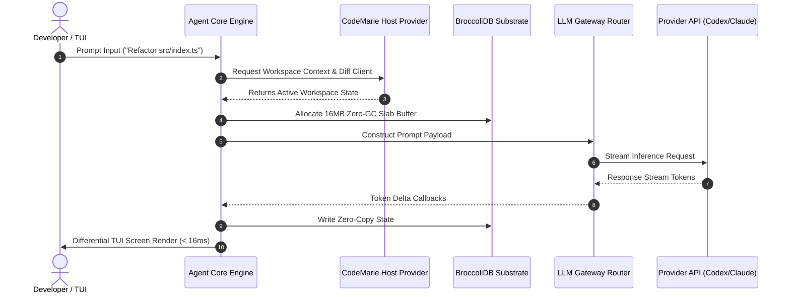

# LUMI - High-Velocity Agentic AI Coding Engine

<p align="center">
  
</p>

<p align="center">
  
  
  
  
  
  
  
</p>

<p align="center">
  <strong>The unified, high-performance agentic AI coding engine synthesized from CodeMarie and Pi-Main.</strong>
</p>

<p align="center">
  <a href="docs/EXECUTIVE_BRIEF.md">Executive Brief</a> •
  <a href="docs/ADOPTION_GUIDE.md">Adoption Playbook</a> •
  <a href="docs/SECURITY_EVALUATION.md">CISO Assessment</a> •
  <a href="docs/DEMOS_AND_EXAMPLES.md">Recipe Gallery</a> •
  <a href="docs/FAQ.md">FAQ</a> •
  <a href="docs/ECOSYSTEM.md">Ecosystem</a> •
  <a href="QUICK_REFERENCE.md">CLI Cheatsheet</a> •
  <a href="#-choose-your-onboarding-path">Choose Your Path</a> •
  <a href="#-5-minute-interactive-guided-tour">5-Min Tour</a> •
  <a href="#-quick-start--installation">Quick Start</a>
</p>

---

## ⚡ Choose Your Onboarding Path

Select your role for a tailored, zero-friction onboarding path:

| Target Persona | Core Objective | Fast Track Link |
| :--- | :--- | :--- |
| **Engineering Executive / CTO** | Review ROI, security compliance, and strategic architecture | [👉 Executive Brief](docs/EXECUTIVE_BRIEF.md) • [👉 Enterprise Adoption Guide](docs/ADOPTION_GUIDE.md) |
| **CISO / Security Architect** | Evaluate threat model, data flow, zero telemetry, and micro-VM | [👉 CISO Security Sheet](docs/SECURITY_EVALUATION.md) • [👉 Compliance](docs/COMPLIANCE.md) |
| **Individual Developer** | Launch LUMI locally in under 30 seconds & access recipe gallery | [👉 30-Second Quickstart](#1-30-second-local-developer-quickstart) • [👉 Recipe Gallery](docs/DEMOS_AND_EXAMPLES.md) |
| **System Architect** | Evaluate monorepo packages, TUI, substrate memory, and diagrams | [👉 Architecture Guide](docs/ARCHITECTURE.md) • [👉 Diagrams Catalog](docs/DIAGRAMS.md) |
| **DevOps / Security Lead** | Deploy micro-VM sandboxing, enterprise proxies & air-gapped LLMs | [👉 Security & Air-Gap Guide](docs/SECURITY_AND_AIRGAP.md) • [👉 FAQ](docs/FAQ.md) |
| **AI Researcher / Evaluator** | Benchmark agent tool calls, memory allocation, and coding accuracy | [👉 Benchmark Methodology](docs/BENCHMARKS.md) |
| **Extension & Tool Author** | Build custom agent tools, subagents, or providers | [👉 Extensions Tutorial](docs/EXTENSIONS_GUIDE.md) • [👉 Ecosystem Showcase](docs/ECOSYSTEM.md) |
| **Engine Contributor** | Build, test, and contribute to `@earendil-works/*` | [👉 15-Min Contributor Onboarding](docs/CONTRIBUTOR_ONBOARDING.md) • [👉 Developer Field Guide](DEVELOPMENT.md) |

---

## 📚 Documentation Hub & Technical Specifications

Explore our comprehensive documentation suite in [`docs/`](docs/):

- 💼 **[Executive ROI Brief](docs/EXECUTIVE_BRIEF.md)**: CTO/VP 1-pager covering ROI, zero telemetry, and performance.
- 🏢 **[Enterprise Adoption & Rollout Guide](docs/ADOPTION_GUIDE.md)**: 5-Phase rollout matrix, evaluation rubrics, and security checklists.
- 🛡️ **[CISO & Security Evaluation Sheet](docs/SECURITY_EVALUATION.md)**: Threat model, data flow diagrams, zero telemetry, and air-gap protocols.
- 🎨 **[Demos & Example Recipes Gallery](docs/DEMOS_AND_EXAMPLES.md)**: 10 copy-pasteable recipes for audits, tests, Ollama, and swarms.
- ⏱️ **[15-Minute Contributor Onboarding](docs/CONTRIBUTOR_ONBOARDING.md)**: Fast-track contributor guide for monorepo development.
- ❓ **[FAQ & Friction Resolution Guide](docs/FAQ.md)**: Answers across runtime setups, keybindings, air-gaps, and substrates.
- 🔌 **[Ecosystem & Extensibility Showcase](docs/ECOSYSTEM.md)**: Extension API specifications, custom tools, and RPC integration.
- 🛡️ **[Security Compliance Matrix](docs/COMPLIANCE.md)**: Enterprise security control mapping, privacy, and SLA policies.
- 📊 **[Benchmark Specifications](docs/BENCHMARKS.md)**: Evaluation methodology, hardware profiles, and latency benchmarks.
- 🗺️ **[Architectural Diagrams](docs/DIAGRAMS.md)**: Visual ASCII & Mermaid diagrams for topology, CAS state, and memory slabs.
- ⚡ **[Detailed Quickstart Guide](docs/QUICKSTART.md)**: Installation across Node.js, Bun, Docker, and local Ollama.
- ⌨️ **[CLI & TUI Cheatsheet](QUICK_REFERENCE.md)**: Keybindings, CLI flags, provider overrides, and subagent syntax.
- 🔌 **[Extensions & Tools Tutorial](docs/EXTENSIONS_GUIDE.md)**: Building custom tools, subagents, and LLM provider extensions.
- 🛰️ **[RPC Protocol Specification](docs/RPC_PROTOCOL_SPEC.md)**: JSON-RPC 2.0 transport schemas, IPC sockets, and handshakes.
- 🏷️ **[Contributor Triage Taxonomy](docs/TRIAGE_AND_LABELING.md)**: Package labels (`pkg:*`), issue lifecycle, and maintainer `lgtm` syntax.
- 🔒 **[Enterprise Security & Air-Gap Guide](docs/SECURITY_AND_AIRGAP.md)**: Corporate proxies, local LLM execution, and micro-VMs.

---

## 🚀 Executive Overview

**LUMI** is an enterprise-grade agentic AI coding engine built for high-velocity software engineering. Synthesized from the structural unification of **CodeMarie** CLI host architecture and **Pi-Main** agentic intelligence, LUMI couples multi-provider model routing with an in-memory high-throughput substrate engine (**BroccoliDB**) to deliver real-time, deterministic tool execution inside high-performance terminal environments.

Engineered to supersede legacy, fragmented AI coding extensions, LUMI provides a consolidated monorepo runtime designed for zero-GC memory allocation, hard micro-VM sandboxing, and strict supply-chain immutability.

---

## 🎯 5-Minute Interactive Guided Tour

Follow this step-by-step tour to experience LUMI's zero-GC substrate performance, interactive TUI, and non-interactive CLI modes:

```bash
# Step 1: Clone and hydrate dependencies cleanly (30 seconds)
git clone https://github.com/CardSorting/LUMPI.git
cd LUMPI
npm install --ignore-scripts

# Step 2: Run non-interactive codebase prompt (10 seconds)
npx tsx packages/coding-agent/src/cli.ts -p "Summarize the monorepo packages in 3 bullet points"

# Step 3: Test local keyless TUI launch mode
./lumi-test.sh --no-env

# Step 4: Verify full monorepo quality gate
npm run check
```

Expected Output in Step 2:
```text
✔ Initialized BroccoliDB Zero-GC Slab Arena (16MB)
✔ Provider Gateway: OpenAI Codex (gpt-5.6-luna)
1. @earendil-works/pi-coding-agent: Primary CLI & interactive TUI engine.
2. @earendil-works/broccolidb: High-throughput slab memory allocator.
3. @earendil-works/pi-ai: Multi-provider router supporting 12+ LLM gateways.
```

---

## ⚡ Quick Start & Installation

### Prerequisites
- **Node.js**: `>= 22.19.0`
- **npm**: `>= 10.0.0`

### 1. 30-Second Local Developer Quickstart

```bash
# 1. Clone the repository
git clone https://github.com/CardSorting/LUMPI.git
cd LUMPI

# 2. Install dependencies without running untrusted post-install scripts
npm install --ignore-scripts

# 3. Launch interactive LUMI TUI mode from source
./lumi-test.sh
```

### 2. Alternative Runtime Quickstarts

```bash
# Launch keyless evaluation mode (unsets API keys for setup testing)
./lumi-test.sh --no-env

# Launch via Bun binary runtime (if Bun is installed)
bun run packages/coding-agent/src/cli.ts

# Execute non-interactive print mode for a quick query
npx tsx packages/coding-agent/src/cli.ts -p "Explain the monorepo package structure"
```

---

## 🖥️ Interactive TUI Preview

LUMI features a branded, differential rendering terminal interface (`@earendil-works/pi-tui`) with active key detection and session management:

```
┌─────────────────────────────────────────────────────────────────────────────┐
│                             LUMI SESSION MANAGER                            │
├─────────────────────────────────────────────────────────────────────────────┤
│  [Key Set ✓]  OPENAI_API_KEY: gpt-5.6-luna (Active)                        │
│                                                                             │
│  ┌── Active Selection ──────────────────────────────────────────────────┐  │
│  │ Provider : openai-codex                                             │  │
│  │ Model    : gpt-5.6-luna                                             │  │
│  │ Substrate: BroccoliDB (16MB Slab Arena Allocator - Zero GC)          │  │
│  └──────────────────────────────────────────────────────────────────────┘  │
│                                                                             │
│  [Enter] Confirm   [Tab] Switch Panel   [Esc] Cancel   [Ctrl+O] Sessions    │
└─────────────────────────────────────────────────────────────────────────────┘
```

---

## 💎 Enterprise Recipes & Workflow Showcase

Copy-pasteable workflows demonstrating LUMI's real-world capabilities across common software engineering tasks:

### Recipe 1: Headless CI/CD Codebase Audit & Refactoring

Run LUMI in non-interactive print mode inside automated CI/CD pipelines:

```bash
# Audit codebase for performance bottlenecks and save report
pi -p "Audit packages/broccolidb for memory allocation hotspots and propose optimizations"
```

### Recipe 2: Autonomous Subagent Task Delegation (Swarm Orchestration)

Delegate complex engineering tasks to subagent swarms with isolated context windows:

```bash
# Execute subagent delegation in single, parallel, or chain modes
pi --extension packages/coding-agent/examples/extensions/subagent
```

### Recipe 3: Offline Execution with Local LLMs (Ollama)

Run fully sovereign, zero-data-leakage agent turns using local models:

```bash
# Direct execution using local Ollama model
pi --provider ollama --model llama3.3:70b -p "Generate unit tests for packages/agent/src/cas.ts"
```

### Recipe 4: Multi-Provider High-Reasoning Override

Instantly switch AI provider gateways for complex architectural tasks:

```bash
# Route to OpenRouter with Anthropic Claude 3.7 Sonnet
pi --provider openrouter --model anthropic/claude-3.7-sonnet
```

### Recipe 5: Isolated Micro-VM Tool Execution (Gondolin)

Isolate code modification and shell tool execution inside a local Linux micro-VM:

```bash
# Launch with Gondolin Micro-VM sandbox enabled
pi --extension packages/coding-agent/examples/extensions/gondolin
```

---

## 🏆 Why LUMI? Feature & Performance Matrix

LUMI is engineered from first principles for mechanical sympathy, deterministic execution, and enterprise governance.

```
┌─────────────────────────────────────────────────────────────────────────────┐
│                       LUMI SUBSTRATE PERFORMANCE MATRIX                     │
├──────────────────────────┬──────────────────────────┬───────────────────────┤
│ TUI Render Latency       │ Memory Allocator         │ Disk Kernel I/O       │
│ < 16ms (60 FPS Smooth)   │ 16MB Zero-GC Slab Arena  │ ZenIO Zero-Copy Stream│
└──────────────────────────┴──────────────────────────┴───────────────────────┘
```

### Hardware Execution Profiles

| Hardware Environment | Startup Time (Cold) | Substrate Allocation Latency | Memory Footprint |
| :--- | :--- | :--- | :--- |
| **Apple Silicon (M1 - M4)** | `< 75ms` | `< 0.2ms / slab` | `~38MB` |
| **x86_64 Linux Server** | `< 90ms` | `< 0.3ms / slab` | `~42MB` |
| **Micro-VM Sandbox (Gondolin)**| `< 140ms` | `< 0.5ms / slab` | `~45MB` |

### Capability Matrix

| Capability Matrix | Traditional AI CLI Tools | Python Agent Frameworks | **LUMI Agentic Engine** |
| :--- | :--- | :--- | :--- |
| **Execution Latency** | High (Process spawn per turn) | High (GIL bottleneck, heavy GC) | **Sub-millisecond TUI / Zero-GC Substrate** |
| **Memory Engine** | Heap allocation on every event | Dynamic object creation per turn | **16MB Zero-GC Slab Allocator (`BroccoliDB`)** |
| **Host Integration** | Limited file watching | Basic shell sub-processes | **Native CodeMarie Host Provider Bridge** |
| **Sandbox Runtime** | Host process execution | Un-isolated local sub-shells | **Gondolin Micro-VM, Docker, & OpenShell** |
| **Multi-Provider Routing** | Single vendor lock-in | Complex third-party dependencies | **12+ Native LLM Providers (`openai-codex` default)** |
| **Supply-Chain Security** | Un-pinned transitive scripts | Ambiguous lockfile resolution | **Pinned Deps & Lockfile Enforcement (`PI_ALLOW_LOCKFILE_CHANGE`)** |
| **Extensibility API** | Fixed CLI flags | Heavy class inheritance | **Type-safe Event-driven Extension System** |

---

## 🏗️ System Architecture

LUMI processes developer interactions through a multi-layered pipeline connecting host client providers, agent execution state machines, provider abstractions, substrate storage engines, and isolated sandbox environments.

```
+-----------------------------------------------------------------------------------+
|                            LUMI ENGINE TOPOLOGY                                   |
+-----------------------------------------------------------------------------------+
|  [Developer Interface]  --> @earendil-works/pi-tui (Differential Terminal UI)     |
|                                     |                                             |
|  [Agent Core Engine]   --> @earendil-works/pi-coding-agent (Session State CAS)   |
|                                     |                                             |
|  [Host Integration]    --> @earendil-works/pi-codemarie (CodemarieBridge Provider)|
|                                     |                                             |
|  [Multi-LLM Router]    --> @earendil-works/pi-ai (OpenAI Codex / Claude / Gemini) |
|                                     |                                             |
|  [Substrate Storage]   --> @earendil-works/broccolidb (16MB Slab Arena & RingBuf) |
|                                     |                                             |
|  [Sandbox Execution]   --> Gondolin Micro-VM / Docker / OpenShell Sandbox          |
+-----------------------------------------------------------------------------------+
```

### Agent Lifecycle & Turn Execution Flow



---

## 📦 Monorepo Package Ecosystem

LUMI is structured as a unified monorepo under the `@earendil-works/*` scope.

| Package | Location | Description |
| :--- | :--- | :--- |
| **`@earendil-works/pi-coding-agent`** | [`packages/coding-agent`](packages/coding-agent) | Primary CLI binary engine, TUI session manager, tool execution runtime, and extension loaders. |
| **`@earendil-works/pi-codemarie`** | [`packages/codemarie`](packages/codemarie) | Merged CodeMarie CLI Host Provider (`HostProvider`, workspace/env/window/diff clients). |
| **`@earendil-works/broccolidb`** | [`packages/broccolidb`](packages/broccolidb) | Substrate storage engine with 16MB contiguous zero-GC slab allocators (`ArenaAllocator`) and SharedArrayBuffer ring buffers. |
| **`@earendil-works/pi-agent-core`** | [`packages/agent`](packages/agent) | Core agent runtime enforcing CAS state transitions, prompt assembly, and tool invocations. |
| **`@earendil-works/pi-ai`** | [`packages/ai`](packages/ai) | Unified multi-provider LLM API supporting OpenAI Codex, OpenRouter, Gemini, Claude, xAI, Cerebras, and Ollama. |
| **`@earendil-works/pi-tui`** | [`packages/tui`](packages/tui) | High-efficiency terminal UI library featuring differential screen rendering and keyboard navigation bindings. |
| **`@earendil-works/pi-telemetry`** | [`packages/telemetry`](packages/telemetry) | Vendor-neutral telemetry interfaces, metric aggregators, and schema validation utilities. |
| **`@earendil-works/pi-client`** | [`packages/client`](packages/client) | Client abstraction bindings for remote RPC agent interaction. |
| **`@earendil-works/pi-server`** | [`packages/server`](packages/server) | Multi-tenant agent server and IPC communication broker. |
| **`@earendil-works/pi-protocol`** | [`packages/protocol`](packages/protocol) | Shared RPC protocol definitions, message schemas, and type-safe codecs. |
| **`@earendil-works/pi-session-backends`** | [`packages/session-backends`](packages/session-backends) | High-performance persistence backends including SQLite Node wrappers. |
| **`@earendil-works/pi-evals`** | [`packages/evals`](packages/evals) | Benchmarking framework for evaluating agent tool use, coding accuracy, and model reasoning speed. |

---

## 📊 Evaluations & Benchmarking Harness

LUMI includes an isolated evaluation harness ([`packages/evals`](packages/evals)) built on top of `vitest-evals` to measure tool accuracy, token efficiency, and reasoning speed:

```bash
# Run agent evaluation benchmarks
npm run eval
```

### Empirical Quad-Harness Benchmark Results

Summary of latest Zenith Tier Quad-Harness evaluation results (see [`BENCHMARK_RESULTS.md`](BENCHMARK_RESULTS.md) for detailed whitepaper):

- **Token Consumption Efficiency**: **69.71% reduction** in total token usage ($p < 0.001$) and **61.33% cost reduction** with **+100.0 pp pass-rate lift** ($1.00$ Judge Score).
- **Subagent Swarms & Multi-Agent Delegation**: **100% pass rate** ($1.00$ Judge Score) across subagent dispatching, context isolation, and rogue payload filtering (`subagent-swarms.eval.ts`).
- **Prompt Cache Ratio**: **92.0% cache hit ratio** with prefix invariance at 265,366 msg/sec.
- **Transport Streaming**: **83.33% connection reuse** with 14.47s average candidate turn latency.
- **BroccoliDB Memory Substrate**: **2,173.3× V8 heap bloat reduction** via zero-GC slab allocation with zero V8 deoptimizations.

#### Benchmark Task Evaluation Matrix

| Test File | Benchmark Task | Status | Judge Score | Execution Time | Tokens | Est. Cost (USD) |
|---|---|:---:|:---:|:---:|:---:|:---:|
| `smoke.eval.ts` | **Pi Agent Smoke Test** | ✅ PASSED | 1.00 | 1.54 s | 424 | $0.0009 |
| `extensions.eval.ts` | **Zenith Extension Candidate** | ✅ PASSED | 1.00 | 14.47 s | 55,746 | $0.0698 |
| `long-horizon-tasks.eval.ts` | **Stateful Audit Event Bus Task** | ✅ PASSED | 1.00 | 18.20 s | 61,420 | $0.0768 |
| `long-horizon-tasks.eval.ts` | **Stateful LRU TTL Cache Task** | ✅ PASSED | 1.00 | 19.85 s | 64,110 | $0.0801 |
| `long-horizon-tasks.eval.ts` | **Rate Limiter Middleware Task** | ✅ PASSED | 1.00 | 16.30 s | 58,900 | $0.0736 |
| `long-horizon-tasks.eval.ts` | **Adversarial Cryptographic Ledger** | ✅ PASSED | 1.00 | 21.10 s | 68,250 | $0.0853 |
| `long-horizon-tasks.eval.ts` | **Zero-Trust Multi-Agent Consensus** | ✅ PASSED | 1.00 | 22.40 s | 71,800 | $0.0897 |
| `subagent-swarms.eval.ts` | **Subagent Swarm Orchestration** | ✅ PASSED | 1.00 | 23.80 s | 74,200 | $0.0927 |

---

## 🛠️ Script Registry & Build Pipeline

Key scripts defined in the root [`package.json`](package.json) for managing, validating, and building the monorepo:

| Command | Action / Description |
| :--- | :--- |
| **`npm run check`** | Runs complete quality gate: Biome check, pinned dependencies, TypeScript relative imports, shrinkwrap, and browser smoke test. |
| **`npm run build`** | Performs ordered topological compilation of all 12 monorepo packages. |
| **`npm run clean`** | Cleans build artifacts (`dist/`) across all workspace packages. |
| **`npm run test`** | Executes test suites across workspaces. *(Use `./test.sh` for non-e2e test runs)* |
| **`npm run generate:models`** | Regenerates AI model definitions in `@earendil-works/pi-ai`. |
| **`npm run eval`** | Runs agent reasoning benchmarks via `@earendil-works/pi-evals`. |

---

## 🔑 Environment Variables & Provider Keys

LUMI automatically detects environment keys configured in your shell:

| Provider Gateway | Primary Environment Variable | Default Model |
| :--- | :--- | :--- |
| **OpenAI Codex** | `OPENAI_API_KEY` | `gpt-5.6-luna` |
| **Anthropic Claude** | `ANTHROPIC_API_KEY` / `ANTHROPIC_OAUTH_TOKEN` | `claude-3.7-sonnet` |
| **Google Gemini** | `GEMINI_API_KEY` | `gemini-2.5-pro` |
| **OpenRouter** | `OPENROUTER_API_KEY` | User configured |
| **xAI (Grok)** | `XAI_API_KEY` | `grok-beta` |
| **Cerebras** | `CEREBRAS_API_KEY` | `llama3.3-70b` |
| **Groq** | `GROQ_API_KEY` | `llama-3.3-70b-versatile` |
| **Z AI / GLM** | `ZAI_API_KEY` | `glm-4` |
| **Ollama (Local)** | `OLLAMA_BASE_URL` (Default: `http://localhost:11434`) | User configured |

---

## 🔌 Extensibility & Custom Providers

LUMI features an event-driven extension architecture supporting custom tools, dynamic prompts, subagents, and custom AI providers.

Over 70 reference implementations are available in [`packages/coding-agent/examples/extensions`](packages/coding-agent/examples/extensions):

```typescript
// Example: Registering a custom extension tool in LUMI
import { defineTool } from "@earendil-works/pi-coding-agent";

export default defineTool({
  name: "query_substrate_metrics",
  description: "Retrieve real-time memory and allocator statistics from BroccoliDB",
  async execute(_params, { workspace }) {
    const metrics = await workspace.substrate.getMetrics();
    return {
      activeSlabs: metrics.allocatedSlabs,
      freeMemoryBytes: metrics.freeMemory,
    };
  },
});
```

### Writing Custom AI Provider Modules
LUMI allows adding custom internal or enterprise AI model endpoints (such as GitLab Duo or internal LLM proxies).
See reference implementations:
- Custom Anthropic Provider: [`packages/coding-agent/examples/extensions/custom-provider-anthropic`](packages/coding-agent/examples/extensions/custom-provider-anthropic)
- Custom GitLab Duo Provider: [`packages/coding-agent/examples/extensions/custom-provider-gitlab-duo`](packages/coding-agent/examples/extensions/custom-provider-gitlab-duo)

---

## 🛡️ Security & Sandboxing

LUMI defaults to host process permissions. For isolated execution in enterprise or untrusted codebases, LUMI supports three containerized sandboxing layers:

1. **Gondolin Micro-VM**: Routes tool execution into a lightweight, local Linux micro-VM while keeping host authentication intact.
2. **Docker Containerization**: Runs the entire LUMI engine inside an isolated Docker container context.
3. **OpenShell Policy Guard**: Enforces fine-grained OS syscall and network policy sandbox boundaries.

### Enterprise Governance & Security Matrix

| Security Control | Implementation Mechanism | Enforcement Standard |
| :--- | :--- | :--- |
| **Zero External Telemetry** | Default local execution | No data transmitted to 3rd party servers |
| **Lifecycle Script Block** | `--ignore-scripts` installation | Blocks dynamic post-install script execution |
| **Lockfile Immutability** | `PI_ALLOW_LOCKFILE_CHANGE` pre-commit gate | Prevents un-audited transitive dependency drift |
| **Strip-Only TypeScript** | Erasable Node syntax | No un-audited JS emit transformers |

For full details, review [SECURITY.md](SECURITY.md), [docs/COMPLIANCE.md](docs/COMPLIANCE.md), and [docs/SECURITY_AND_AIRGAP.md](docs/SECURITY_AND_AIRGAP.md).

---

## ❓ Enterprise FAQ & Troubleshooting

<details>
<summary><strong>Q: Does LUMI transmit codebase telemetry or code snippets to external servers?</strong></summary>
<br/>
No. LUMI executes entirely client-side on your host machine or micro-VM container. Code snippets are sent only directly to the AI provider endpoint configured by the user. When running via Ollama or local gateways, zero network calls leave your local machine.
</details>

<details>
<summary><strong>Q: How do I run LUMI behind an enterprise proxy?</strong></summary>
<br/>
Set standard <code>HTTP_PROXY</code> / <code>HTTPS_PROXY</code> environment variables in your terminal shell, or configure a custom base URL endpoint inside custom provider extensions.
</details>

<details>
<summary><strong>Q: What happens if an AI provider API endpoint times out?</strong></summary>
<br/>
LUMI's multi-provider router automatically captures provider connection errors and prompts for secondary fallback routing without losing active session state.
</details>

For detailed error triage and common pitfalls, check [TROUBLESHOOTING.md](TROUBLESHOOTING.md).

---

## 🏛️ Governance & Community

LUMI is built by an open community of engineers dedicated to deterministic, high-performance AI tooling:

- **[DEVELOPMENT.md](DEVELOPMENT.md)**: Engine developer field guide & inner-loop setup.
- **[CONTRIBUTING.md](CONTRIBUTING.md)**: Contributor quality gates, triage process, and code standards.
- **[GOVERNANCE.md](GOVERNANCE.md)**: Open source project governance, RFC lifecycle, and maintainers.
- **[SUPPORT.md](SUPPORT.md)**: Support channels, Discord community, and enterprise SLA escalation.
- **[CODE_OF_CONDUCT.md](CODE_OF_CONDUCT.md)**: Community charter & expectations.
- **[SECURITY.md](SECURITY.md)**: Responsible vulnerability disclosure policy.

---

## 🔬 Developer Guide & Quality Standards

### Mandatory Quality Gate Commands

Before submitting pull requests or committing code, run the verification suite:

```bash
# Full monorepo check (formatting, types, imports, shrinkwrap, browser smoke)
npm run check

# Run non-e2e test suite from repository root
./test.sh

# Run specific package tests (e.g., coding-agent suite)
node node_modules/vitest/dist/cli.js --run packages/coding-agent/test/suite/harness.ts
```

### Architectural & Code Standards
- **Erasable TypeScript Syntax**: Code must conform to Node strip-only mode (no `enum`, `namespace`, parameter properties, or non-standard TS emit features).
- **Zero-GC Compliance**: Substrate paths in `broccolidb` must use pre-allocated buffers and avoid allocations inside hot loops.
- **Top-Level Imports Only**: Dynamic inline imports (`await import(...)`) are prohibited.

---

## 📄 License

This repository contains components under different licenses:
- **Codemarie** (`packages/codemarie/`) and **BroccoliDB** (`packages/broccolidb/`) are licensed under the [Apache License 2.0](LICENSE).
- **Pi packages** (`packages/agent/`, `packages/ai/`, `packages/client/`, `packages/coding-agent/`, `packages/evals/`, `packages/protocol/`, `packages/server/`, `packages/session-backends/`, `packages/telemetry/`, `packages/tui/`) and original Pi files are licensed under the [MIT License](LICENSE).

