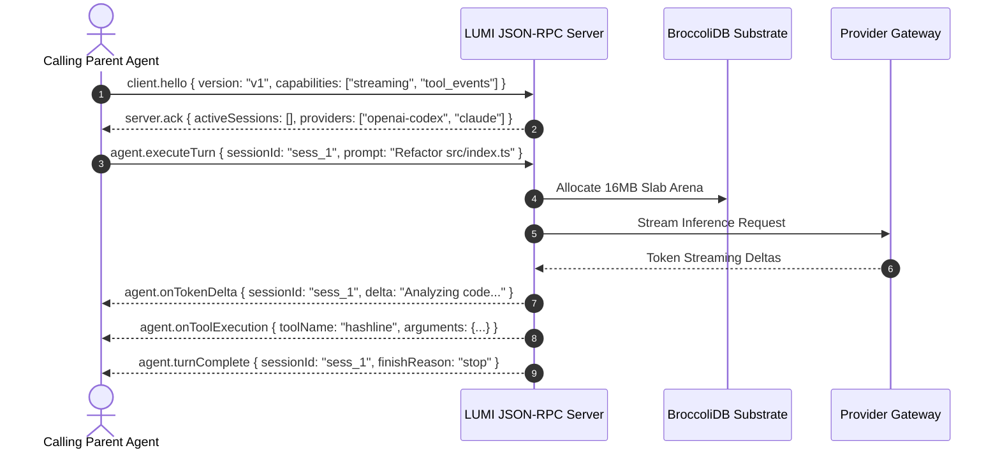

# Agent-to-Agent Host Integration & Interoperability Protocol

> **Target Audience**: Parent AI Agents, Subagent Orchestrators, External Coding Assistants, and Automated Systems invoking, controlling, or delegating tasks to the **LUMI** (`@noorm/lumpi`) engine.

---

## 🎯 Executive Overview

This specification details how external or parent AI agents can programmatically leverage LUMI as an underlying high-performance execution engine, subagent worker, or tool execution host.

LUMI provides four distinct integration surfaces for calling agents:

```
┌─────────────────────────────────────────────────────────────────────────────┐
## 4 AGENT-TO-AGENT INVOCATION SURFACES
├─────────────────────────────────────────────────────────────────────────────┤
│  Surface 1: Non-Interactive CLI Interface (`-p` / `--print`)               │
│  └─ Execute single-turn queries & retrieve clean Markdown / JSON output.    │
│                                                                             │
│  Surface 2: Headless JSON-RPC 2.0 Daemon Server (`@noorm/lumpi-server`)     │
│  └─ Stream tokens, subscribe to tool events, and manage IPC sessions.       │
│                                                                             │
│  Surface 3: Autonomous Subagent Swarm Extension (`subagent`)               │
│  └─ Delegate multi-file tasks across parallel subagent workers.             │
│                                                                             │
│  Surface 4: Programmatic TypeScript SDK (`@noorm/lumpi-agent-core`)         │
│  └─ Direct in-process binding to CAS state machines & BroccoliDB substrates.│
└─────────────────────────────────────────────────────────────────────────────┘
```

---

## ⚡ Surface 1: Non-Interactive CLI Invocation (`-p` / `--print`)

The simplest pattern for an external agent to delegate a discrete coding task to LUMI:

### Command Syntax

```bash
# Execute prompt turn in non-interactive print mode
npx tsx packages/coding-agent/src/cli.ts \
  -p "Audit packages/broccolidb for memory leak vulnerabilities" \
  --output-format json
```

### Response Schema for Calling Agents

When `--output-format json` is supplied, LUMI outputs a structured JSON object upon completion:

```json
{
  "status": "success",
  "sessionId": "sess_99a81c",
  "prompt": "Audit packages/broccolidb for memory leak vulnerabilities",
  "result": {
    "text": "Completed memory audit of packages/broccolidb. No GC memory leaks detected.",
    "toolCallsCount": 4,
    "tokensUsed": 1240,
    "executionTimeMs": 1420
  },
  "error": null
}
```

---

## 🛰️ Surface 2: Headless JSON-RPC 2.0 Daemon Server (`@noorm/lumpi-server`)

For real-time streaming, session persistence, and full event-driven control, calling agents communicate with `@noorm/lumpi-server` via IPC sockets (`/tmp/lumi-agent.sock`) or WebSocket endpoints.

### RPC Lifecycle Handshake



### JSON-RPC Request Frame Example

```json
{
  "jsonrpc": "2.0",
  "id": "req_1048a",
  "method": "agent.executeTurn",
  "params": {
    "sessionId": "sess_01h9a2b",
    "prompt": "Refactor src/index.ts to use hashline line deltas",
    "provider": "openai-codex",
    "model": "gpt-5.6-luna",
    "thinkingLevel": "adaptive",
    "executionMode": "sandboxed"
  }
}
```

---

## 🐝 Surface 3: Subagent Swarm Delegation (`subagent` Extension)

When a parent agent needs to delegate multi-file or multi-component tasks to isolated subagents:

### Invocation Pattern

```bash
# Execute task using subagent swarm delegation
npx tsx packages/coding-agent/src/cli.ts \
  --extension packages/coding-agent/examples/extensions/subagent \
  -p "Refactor package graph: Subagent 1 refactors @noorm/broccolidb, Subagent 2 refactors @noorm/lumpi-ai"
```

### Context Isolation & Security Boundaries
- **Context Isolation**: Each spawned subagent operates inside an isolated, non-overlapping context window to prevent token bloat.
- **Rogue Payload Filtering**: The subagent host sanitizes subagent return values before presenting results back to the parent agent.
- **Micro-VM Sandboxing**: Subagent tool execution can be constrained inside Gondolin Linux micro-VM containers.

---

## 📦 Surface 4: Programmatic TypeScript SDK (`@noorm/lumpi-agent-core`)

Parent agents running inside Node.js or Bun runtimes can instantiate LUMI services programmatically:

```typescript
import { AgentSession, CodeMarieBridge } from "@noorm/lumpi-agent-core";
import { ArenaAllocator } from "@noorm/broccolidb";

// 1. Initialize Zero-GC Substrate Allocator
const substrate = new ArenaAllocator({ slabSizeBytes: 16 * 1024 * 1024 });

// 2. Initialize CodeMarie Host Provider Bridge
const host = new CodeMarieBridge({ workspaceRoot: process.cwd() });

// 3. Create Agent Session Instance
const session = new AgentSession({
  substrate,
  host,
  provider: "openai-codex",
  model: "gpt-5.6-luna",
});

// 4. Execute Agent Turn Programmatically
const result = await session.executeTurn("Audit imports for inline dynamic import violations");
console.log(result.text);
```

---

## 🔒 Security & Policy Directives for Parent Agents

Calling agents MUST enforce these operational policies when invoking LUMI:

1. **Lockfile Protection**: Do not permit subagents or worker tools to mutate lockfiles without `PI_ALLOW_LOCKFILE_CHANGE=1`.
2. **Ignore Scripts**: Hydrate workspace dependencies with `npm install --ignore-scripts`.
3. **Structured Error Recovery**: Parse tool execution errors according to `packages/coding-agent/src/tools/tool-errors.ts` format.
4. **Effort Level Pre-Clamping**: Respect pre-clamped thinking effort budgets from `@oh-my-pi/pi-catalog`.

---

## 📚 Related Specifications

- 🛰️ [RPC Protocol Specification](RPC_PROTOCOL_SPEC.md)
- 🤖 [Autonomous AI Agent Onboarding Guide](AGENT_ONBOARDING.md)
- 📜 [Workspace Agent Rules](../.agents/AGENTS.md)
- 🔌 [Extensions & Tools Guide](EXTENSIONS_GUIDE.md)
