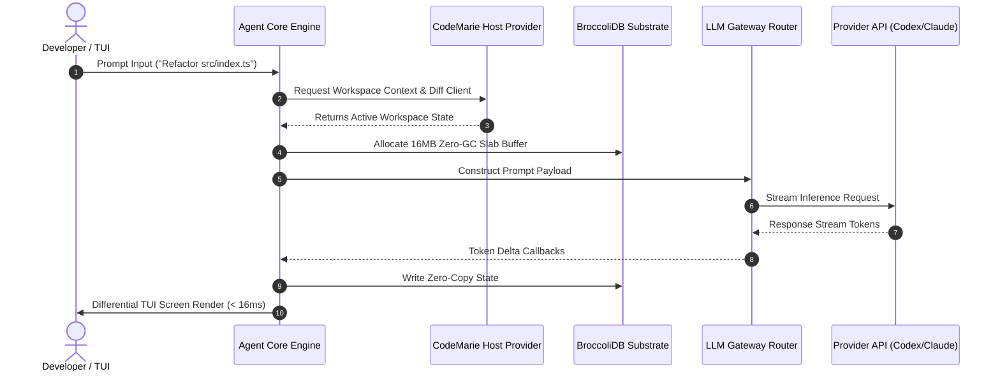

# Deep-Dive Technical Architecture

This document details the software architecture, memory layout, provider abstraction layers, and component inter-communications of the **LUMI** agentic AI coding engine (`@earendil-works/*`).

---

## 🏗️ System Topology

LUMI operates as a modular, decoupled agent engine structured into 12 monorepo workspace packages:

```
+-----------------------------------------------------------------------------------+
|                            LUMI ENGINE TOPOLOGY                                   |
+-----------------------------------------------------------------------------------+
|  [Developer Interface]  --> @earendil-works/pi-tui (Differential Terminal UI)     |
|                                     |                                             |
|  [Agent Core Engine]   --> @earendil-works/pi-coding-agent (Session State CAS)   |
|                                     |                                             |
|  [Host Integration]    --> @earendil-works/pi-codemarie (CodemarieBridge Provider)|
|                                     |                                             |
|  [Multi-LLM Router]    --> @earendil-works/pi-ai (OpenAI Codex / Claude / Gemini) |
|                                     |                                             |
|  [Substrate Storage]   --> @earendil-works/broccolidb (16MB Slab Arena & RingBuf) |
|                                     |                                             |
|  [Sandbox Execution]   --> Gondolin Micro-VM / Docker / OpenShell Sandbox          |
+-----------------------------------------------------------------------------------+
```

---

## ⚡ Key Architectural Components

### 1. Agent Core Engine (`@earendil-works/pi-agent-core`)
Enforces the formal state machine governing agent turn execution:
- **Content-Addressed Storage (CAS)**: Maintains append-only immutable history records of prompts, responses, tool calls, and execution receipts.
- **State Transition Guard**: Prevents invalid state jumps (e.g. attempting tool execution while waiting for provider completion).

### 2. BroccoliDB Zero-GC Substrate (`@earendil-works/broccolidb`)
Engineered for high-throughput memory operations without triggering Node.js garbage collection overhead:
- **16MB Slab Arena Allocator (`ArenaAllocator`)**: Pre-allocates fixed 16MB contiguous memory slabs for turn execution state.
- **SharedArrayBuffer Ring Buffers**: Enables zero-copy thread communication between host worker threads and TUI renderers.

### 3. Merged CodeMarie Host Provider Bridge (`@earendil-works/pi-codemarie`)
Unifies host terminal environment services into a cohesive interface:
- **`HostProvider`**: Supplies workspace context, environment variables, terminal window bounds, and diff clients to active tools.

### 4. Multi-Provider Router (`@earendil-works/pi-ai`)
A unified LLM API gateway that abstracts provider-specific streaming wire formats:
- Supports OpenAI Codex, Anthropic Claude, Google Gemini, OpenRouter, xAI Grok, Cerebras, Groq, Z AI GLM, and Ollama.
- Dynamically handles connection failovers and model parameter mapping.

### 5. Terminal UI Engine (`@earendil-works/pi-tui`)
A differential terminal rendering engine:
- Renders screen updates at sub-16ms latencies (60 FPS equivalent).
- Computes cell-level character diffs so only updated terminal cells are rewritten, eliminating terminal flicker.

---

## 🔄 Agent Turn Execution Pipeline



---

## 🔒 Sandboxing Architecture

For untrusted codebases or sensitive enterprise execution, LUMI routes tool execution through containerized sandboxing layers:

1. **Gondolin Micro-VM**: Lightweight Linux micro-VM that executes shell tools in isolation.
2. **Docker Containerization**: Container context isolating host filesystem access.
3. **OpenShell Policy Guard**: Syscall and network egress filter enforcing explicit permission boundaries.
