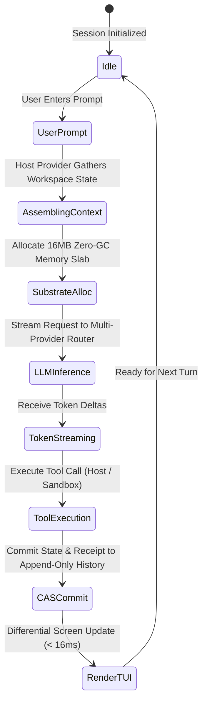
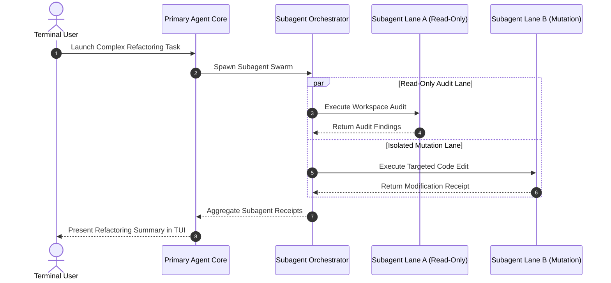

# Architectural Visualizations & Diagram Catalog

This document provides visual diagrams illustrating the component relationships, state transitions, memory layouts, and subagent orchestration topologies of **LUMI** (`@earendil-works/*`).

---

## 1. Monorepo Package Dependency Topology

```
+-----------------------------------------------------------------------------------+
|                           MONOREPO DEPENDENCY TOPOLOGY                            |
+-----------------------------------------------------------------------------------+
|                                                                                   |
|    @earendil-works/pi-coding-agent (CLI Binary & Session TUI Host)               |
|            │                                                                      |
|            ├───> @earendil-works/pi-agent-core (CAS State Machine)               |
|            ├───> @earendil-works/pi-codemarie (Host Provider Bridge)             |
|            ├───> @earendil-works/pi-ai (Multi-LLM Gateway Router)                 |
|            ├───> @earendil-works/pi-tui (Differential Terminal UI)                |
|            └───> @earendil-works/broccolidb (16MB Slab Arena Memory Substrate)   |
|                                                                                   |
|    Shared Packages:                                                               |
|    - @earendil-works/pi-protocol (RPC Schemas)                                   |
|    - @earendil-works/pi-telemetry (Metrics)                                      |
|    - @earendil-works/pi-session-backends (Persistence Wrappers)                  |
|    - @earendil-works/pi-evals (Benchmark Harness)                                |
+-----------------------------------------------------------------------------------+
```

---

## 2. Agent Turn Execution & CAS State Transition Diagram



---

## 3. BroccoliDB Zero-GC Memory Substrate Layout

```
+-----------------------------------------------------------------------------------+
|                      BROCCOLIDB 16MB SLAB ARENA MEMORY LAYOUT                     |
+-----------------------------------------------------------------------------------+
|  [Contiguous 16MB SharedArrayBuffer Memory Region]                                |
|  ┌──────────────────┬──────────────────┬──────────────────┬────────────────────┐  |
|  │ Slab 0 (State)   │ Slab 1 (Tokens)  │ Slab 2 (Diffs)   │ Slab N (RingBuf)   │  |
|  │ [0x0000..0x3FFF] │ [0x4000..0x7FFF] │ [0x8000..0xBFFF] │ [0xC000..0xFFFF]   │  |
|  └──────────────────┴──────────────────┴──────────────────┴────────────────────┘  |
|  * Pointer offset arithmetic eliminates V8 object allocation during hot loops.    |
+-----------------------------------------------------------------------------------+
```

---

## 4. Subagent Swarm Delegation Workflow


