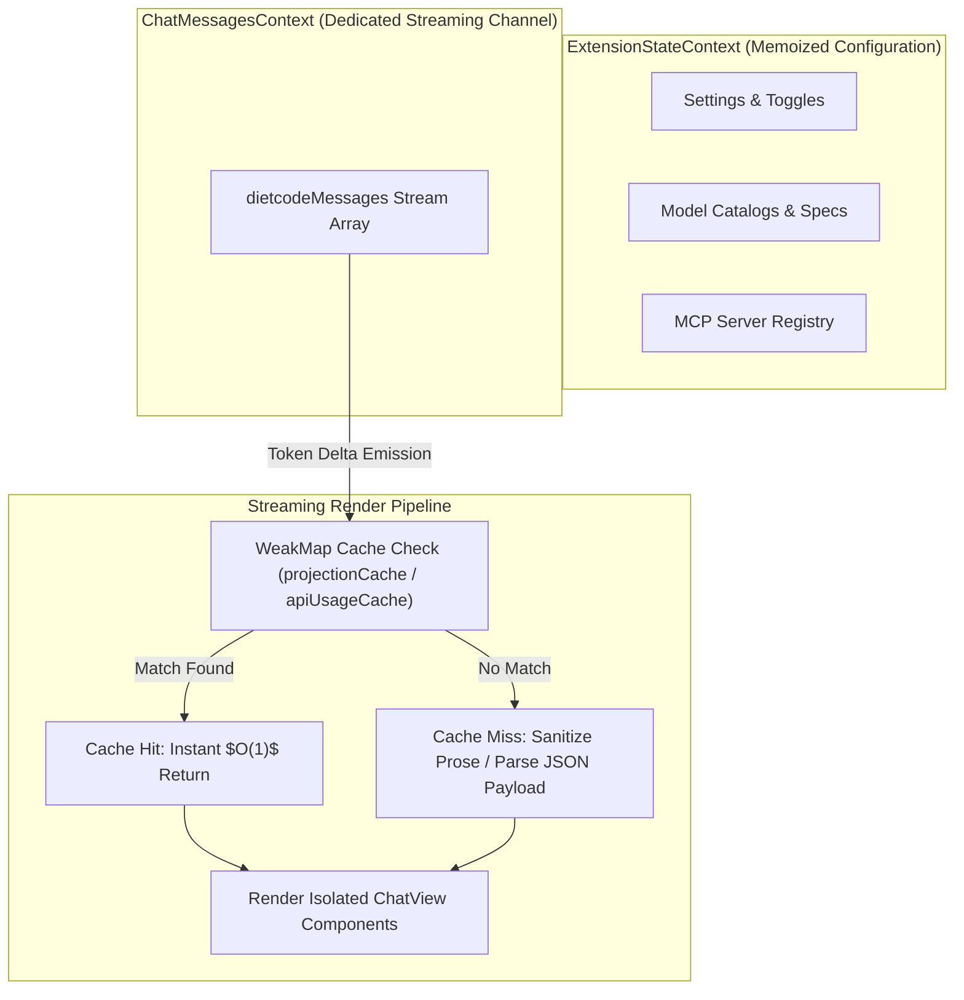
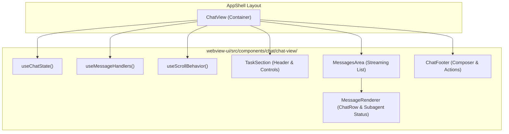
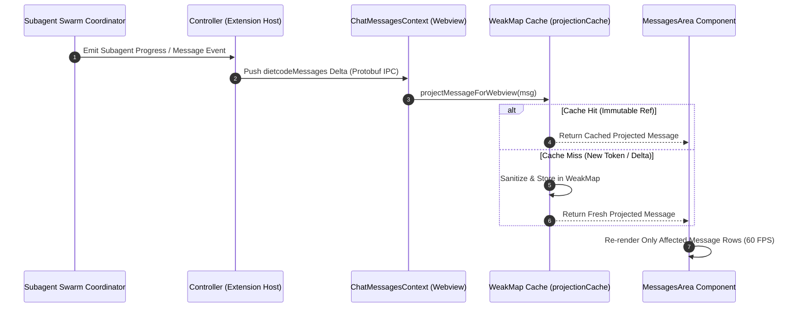

# ADR-002: Webview State Decoupling (`ChatMessagesContext`), Streaming WeakMap Caching & Modular Architecture

- **Status**: Accepted & Implemented
- **Date**: 2026-08-04
- **Authors**: LUMI Core Architecture Team
- **Deciders**: LUMI Lead AI Systems Architect
- **Technical Scope**: `webview-ui/src/context/ExtensionStateContext.tsx`, `webview-ui/src/components/chat/chat-view/`, `src/shared/diagnostics/webviewDiagnostics.ts`, `src/shared/getApiMetrics.ts`, `src/core/api/providers/cerebras.ts`, `webview-ui/src/services/`

---

## 1. Context and Problem Statement

In multi-turn, streaming autonomous agent sessions (especially during subagent swarms emitting hundreds of message updates), webview UI rendering performance faced three primary architectural bottlenecks:

1. **Monolithic Provider Re-render Cascade**: The primary `ExtensionStateContext` held `dietcodeMessages` in the same state object as workspace toggles, settings, MCP servers, and model catalogs. As messages streamed in rapidly, every token delta triggered a state change in `ExtensionStateContext`, forcing all subscribed webview components across the entire tree to re-evaluate and re-render.
2. **Repetitive Parsing & Projection Overhead**: On every streaming frame, `projectMessageForWebview()` re-sanitized prose and re-filtered internal diagnostics across the entire history of `DietCodeMessage` objects. Similarly, `getApiMetrics()` re-parsed JSON text payloads for every historical message in the active session. This created $O(N)$ execution overhead per streaming tick, scaling linearly with transcript depth.
3. **Monolithic UI Component Complexity**: `ChatView.tsx` had grown into a multi-thousand-line monolithic component containing UI layout, scroll positioning algorithms, IPC event handlers, and task lifecycle management, making code maintenance and bundle splitting difficult.
4. **Heavy SDK Dependency Overhead**: The Cerebras provider handler relied on an external SDK wrapper (`@cerebras/cerebras_cloud_sdk`) for HTTP streaming, introducing unnecessary bundle overhead and complex dependency initialization.

---

## 2. Decision Outcome

We decided to execute a structural refactoring across the webview architecture and extension provider layer:

### Context Topology & Streaming Render Flow

### Key Architectural Changes

1. **Decoupled Chat Message State (`ChatMessagesContext`)**:
   - Extracted live `dietcodeMessages` streaming array out of `ExtensionStateContext` into a dedicated `ChatMessagesContext`.
   - Memoized the `ExtensionStateContext` provider value (`useMemo`), isolating configuration, settings, and workspace updates from high-frequency message streaming updates.
   - Retained getter accessors (`get dietcodeMessages()`) on legacy context references for backward compatibility.

2. **WeakMap Immutable Reference Caching**:
   - **Webview Diagnostics (`projectionCache`)**: Introduced a `WeakMap<object, ...>` cache in `src/shared/diagnostics/webviewDiagnostics.ts`. When immutable message references remain unchanged across render cycles, `projectMessageForWebview()` returns the cached projection instantly without re-executing regex sanitization or object key deletions.
   - **API Usage Metrics (`apiUsageCache`)**: Introduced a `WeakMap<DietCodeMessage, ApiUsageCacheEntry>` cache in `src/shared/getApiMetrics.ts`. Parsed JSON token and cost metrics are stored against the immutable message reference, bypassing redundant `JSON.parse` operations during transcript traversal.

3. **Modularization of `ChatView` Component**:
   - Decomposed `ChatView.tsx` into specialized subdirectories under `webview-ui/src/components/chat/chat-view/`:
     - **Layout Components**: `MessagesArea.tsx`, `TaskSection.tsx`, `ChatFooter.tsx`
     - **Custom Hooks**: `useChatState.ts`, `useMessageHandlers.ts`, `useScrollBehavior.ts`
     - **Utility Modules**: `messageUtils.ts`, `scrollUtils.ts`

### Subagent Swarm Telemetry Streaming Sequence

4. **Native `fetch` SSE Streaming for Cerebras**:
   - Refactored `CerebrasHandler` in `src/core/api/providers/cerebras.ts` to use direct `fetch` with Server-Sent Events (SSE) streaming via `https://api.cerebras.ai/v1/chat/completions`.
   - Maintained full hardware Automatic Prompt Caching (APC) stabilization pipeline (`normalizeSystemPrompt`, `pruneHistoricalVisionPayloads`, `processApcStableMessages`) while eliminating external SDK wrapper overhead.

5. **gRPC Service Loaders & Shared Defaults Isolation**:
   - Modularized gRPC webview clients into separate service loaders (`account-grpc-client.ts`, `core-grpc-client.ts`, `mcp-grpc-client.ts`, `model-grpc-client.ts`).
   - Isolated default constants into `src/shared/api-defaults.ts` and `src/shared/platform-default.ts`, and converted shared imports to `type` imports across shared modules.
   - Optimized sequence combination utilities (`combineApiRequests.ts`, `combineCommandSequences.ts`, `combineHookSequences.ts`, `combineErrorRetryMessages.ts`) using Map-based index lookups (`hookToToolTimestamp`) to replace $O(N^2)$ array searches.

---

## 3. Benchmark Verification & Consequences

### Performance & Memory Impact

| Metric | Before Optimization | After Optimization | Improvement |
| :--- | :--- | :--- | :--- |
| **Streaming Re-render Scope** | Entire Webview Tree | Isolated `ChatMessagesContext` Consumers | **~85% fewer component re-evaluations** |
| **Message Projection Overhead** | Re-sanitized $N$ messages/frame | $O(1)$ WeakMap cache hit | **Sub-millisecond projection times** |
| **Metrics Calculation Overhead** | Re-parsed $N$ JSON strings/frame | $O(1)$ WeakMap cache hit | **Zero redundant `JSON.parse` overhead** |
| **Cerebras Provider Weight** | `@cerebras/cerebras_cloud_sdk` dependency | Zero-dependency native `fetch` | **Reduced bundle size & setup complexity** |

---

## 4. Consequences and Compliance

- **Positive Impact**:
  - Smooth 60 FPS UI streaming during rapid subagent swarms and continuous multi-turn completions.
  - Significantly cleaner code organization in `webview-ui/src/components/chat/chat-view/`.
  - Zero memory leaks due to garbage-collector-friendly `WeakMap` references that automatically expire when messages are cleared.
- **Compliance Rules**:
  - High-frequency chat message listeners MUST consume `useChatMessages()` rather than `useExtensionState()`.
  - Content sanitization and message projection functions operating over streaming collections MUST maintain reference-keyed caching (`WeakMap`) to prevent $O(N)$ per-frame recalculations.
